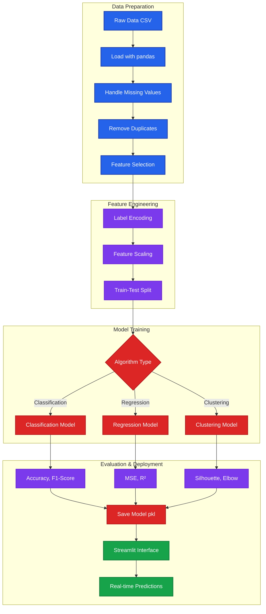

# Machine Learning Projects Collection

A comprehensive repository of 20 machine learning projects implemented with Streamlit web interfaces. This collection covers supervised learning (classification and regression) and unsupervised learning (clustering) algorithms.

## 📋 Table of Contents

- [Overview](#overview)
- [Project Categories](#project-categories)
- [Technology Stack](#technology-stack)
- [Quick Start](#quick-start)
- [Project Structure](#project-structure)
- [Common Features](#common-features)
- [Navigation](#navigation)

## 🔍 Overview

This repository demonstrates practical implementations of fundamental and advanced machine learning algorithms. Each project includes:

- **Interactive Streamlit Web Interface**: User-friendly UI for each algorithm
- **Real-world Applications**: Customer segmentation, stock prediction, clustering analysis
- **Complete ML Pipeline**: Data preprocessing, model training, evaluation, and prediction
- **Professional Code**: Well-structured, documented Python code
- **Model Persistence**: Save and load trained models
- **Comprehensive Documentation**: Individual README for each project

## 📊 Project Categories

### Supervised Learning - Classification (11 Projects)

High-accuracy classification algorithms for customer segmentation and categorical prediction:

| Algorithm | Description | Key Strength |
|-----------|-------------|--------------|
| [Naive Bayes](Supervised_Learning/Classification/Naive_bayes/) | Probabilistic classifier | Fast, works well with small data |
| [XGBoost](Supervised_Learning/Classification/XgBoost/) | Extreme gradient boosting | State-of-the-art performance |
| [Decision Trees](Supervised_Learning/Classification/DecisionTrees/) | Tree-based learning | Interpretable, visual |
| [AdaBoost](Supervised_Learning/Classification/AdaBoost/) | Adaptive boosting | Focuses on hard cases |
| [CatBoost](Supervised_Learning/Classification/CatBoost/) | Categorical boosting | Native categorical support |
| [GBM](Supervised_Learning/Classification/GBM/) | Gradient boosting | Flexible loss functions |
| [KNN](Supervised_Learning/Classification/KNN/) | K-nearest neighbors | Simple, instance-based |
| [LightGBM](Supervised_Learning/Classification/LightGBM/) | Light gradient boosting | Fast, memory-efficient |
| [Logistic Regression](Supervised_Learning/Classification/Logistic_regression/) | Statistical classification | Interpretable probabilities |
| [Random Forests](Supervised_Learning/Classification/RandomForests/) | Ensemble of trees | Robust, feature importance |
| [SVM](Supervised_Learning/Classification/SVM/) | Support vector machine | Optimal margin separation |

### Supervised Learning - Regression (6 Projects)

Continuous value prediction with various regularization techniques:

| Algorithm | Description | Key Strength |
|-----------|-------------|--------------|
| [Simple Linear Regression](Supervised_Learning/Regression/simple-linear-regression/) | Stock price prediction | Simple, interpretable |
| [Multiple Linear Regression](Supervised_Learning/Regression/Multiple-Linear-Regression/) | Multi-feature prediction | Handles multiple predictors |
| [Lasso Regression](Supervised_Learning/Regression/Lasso_regression/) | L1 regularization | Feature selection |
| [Ridge Regression](Supervised_Learning/Regression/Ridge-regression/) | L2 regularization | Handles multicollinearity |
| [Elastic Net](Supervised_Learning/Regression/Elastic_Net_Regression/) | L1 + L2 regularization | Best of both worlds |
| [Polynomial Regression](Supervised_Learning/Regression/Polynomial_Regression/) | Non-linear modeling | Captures curved relationships |

### Unsupervised Learning - Clustering (3 Projects)

Data segmentation and pattern discovery without labels:

| Algorithm | Description | Key Strength |
|-----------|-------------|--------------|
| [K-Means](Unsupervising_Learning/Clustering/K-means/) | Centroid-based clustering | Fast, scalable |
| [DBSCAN](Unsupervising_Learning/Clustering/DBSCAN/) | Density-based clustering | Finds arbitrary shapes, detects outliers |
| [Hierarchical Clustering](Unsupervising_Learning/Clustering/Hierarchical_Clustering/) | Tree-based clustering | Dendrogram visualization, flexible K |

## 🛠️ Technology Stack

### Core Technologies

- **Python 3.8+** - Programming language
- **Streamlit** - Web application framework for all projects
- **scikit-learn** - Primary ML library
- **pandas** - Data manipulation and analysis
- **numpy** - Numerical computing

### Specialized Libraries

- **XGBoost** - Extreme gradient boosting
- **CatBoost** - Categorical feature boosting
- **LightGBM** - Fast gradient boosting
- **matplotlib** - Basic visualizations
- **seaborn** - Statistical visualizations
- **scipy** - Scientific computing (hierarchical clustering)

### Data Preprocessing

- **LabelEncoder** - Categorical encoding
- **StandardScaler / MinMaxScaler** - Feature scaling
- **PCA** - Dimensionality reduction
- **Train-test split** - Model validation

## 📦 Quick Start

### Prerequisites

```bash
# Python 3.8 or higher
python --version

# pip package manager
pip --version
```

### Installation

1. **Clone the repository:**
```bash
git clone https://github.com/baloglu321/Machine_learning_projects.git
cd Machine_learning_projects
```

2. **Navigate to a specific project:**
```bash
# Example: Naive Bayes
cd Supervised_Learning/Classification/Naive_bayes
```

3. **Install project dependencies:**
```bash
pip install -r requirements.txt
```

4. **Run the Streamlit application:**
```bash
# For projects using Home.py
streamlit run Home.py

# For projects using main.py
streamlit run main.py
```

5. **Access the web interface:**
   - Open browser to `http://localhost:8501`

## 📁 Project Structure

```
Machine_learning_projects/
├── Supervised_Learning/
│   ├── Classification/
│   │   ├── Naive_bayes/
│   │   │   ├── Home.py
│   │   │   ├── utils.py
│   │   │   ├── data/
│   │   │   ├── models/
│   │   │   ├── requirements.txt
│   │   │   └── README.md
│   │   ├── XgBoost/
│   │   ├── DecisionTrees/
│   │   ├── AdaBoost/
│   │   ├── CatBoost/
│   │   ├── GBM/
│   │   ├── KNN/
│   │   ├── LightGBM/
│   │   ├── Logistic_regression/
│   │   ├── RandomForests/
│   │   └── SVM/
│   └── Regression/
│       ├── simple-linear-regression/
│       ├── Multiple-Linear-Regression/
│       ├── Lasso_regression/
│       ├── Ridge-regression/
│       ├── Elastic_Net_Regression/
│       └── Polynomial_Regression/
├── Unsupervising_Learning/
│   └── Clustering/
│       ├── K-means/
│       ├── DBSCAN/
│       └── Hierarchical_Clustering/
└── README.md (this file)
```

### Common Project Files

- **Home.py / main.py**: Streamlit web application interface
- **utils.py**: ML model implementation and utilities
- **data/**: Training and testing datasets (CSV files)
- **models/**: Saved model artifacts (generated at runtime)
- **requirements.txt**: Python dependencies
- **README.md**: Project-specific documentation

## ✨ Common Features

All projects share these characteristics:

### 1. **Interactive Web Interface**
- Built with Streamlit for accessibility
- No command-line expertise required
- Real-time predictions and visualizations

### 2. **Complete ML Pipeline**
- Data loading and preprocessing
- Feature engineering (encoding, scaling)
- Model training and evaluation
- Prediction on new data

### 3. **Model Persistence**
- Models saved using pickle
- Quick loading for inference
- Encoder and scaler persistence

### 4. **Performance Metrics**
Classification:
- Accuracy score
- Classification report
- Confusion matrix

Regression:
- Mean Squared Error (MSE)
- R² score
- Visual comparisons

Clustering:
- Silhouette score
- Elbow method
- Visual cluster separation

### 5. **Data Preprocessing**
- Missing value handling
- Duplicate removal
- Label encoding for categorical features
- Feature scaling (StandardScaler)
- Train-test splitting

## 🏛️ Machine Learning Workflow



## 🎯 Use Case Matrix

| Use Case | Recommended Algorithms |
|----------|------------------------|
| Customer Segmentation | Naive Bayes, K-Means, Random Forests |
| Stock Price Prediction | Simple Linear Regression, Polynomial Regression |
| Fraud Detection | AdaBoost, XGBoost, SVM, DBSCAN (outliers) |
| Image Classification | SVM, Random Forests, CatBoost |
| Recommendation Systems | K-Means, Hierarchical Clustering |
| Medical Diagnosis | Logistic Regression, Random Forests |
| Feature Selection | Lasso Regression, Elastic Net |
| Handling Categorical Data | CatBoost, LightGBM |
| Fast Training on Large Data | LightGBM, K-Means |
| Interpretability Required | Logistic Regression, Decision Trees |

## 📚 Learning Path

### Beginner
1. [Simple Linear Regression](Supervised_Learning/Regression/simple-linear-regression/)
2. [K-Nearest Neighbors](Supervised_Learning/Classification/KNN/)
3. [K-Means Clustering](Unsupervising_Learning/Clustering/K-means/)

### Intermediate
4. [Logistic Regression](Supervised_Learning/Classification/Logistic_regression/)
5. [Decision Trees](Supervised_Learning/Classification/DecisionTrees/)
6. [Multiple Linear Regression](Supervised_Learning/Regression/Multiple-Linear-Regression/)
7. [Hierarchical Clustering](Unsupervising_Learning/Clustering/Hierarchical_Clustering/)

### Advanced
8. [Random Forests](Supervised_Learning/Classification/RandomForests/)
9. [XGBoost](Supervised_Learning/Classification/XgBoost/)
10. [LightGBM](Supervised_Learning/Classification/LightGBM/)
11. [DBSCAN](Unsupervising_Learning/Clustering/DBSCAN/)

### Expert
12. [CatBoost](Supervised_Learning/Classification/CatBoost/)
13. [Elastic Net](Supervised_Learning/Regression/Elastic_Net_Regression/)
14. [SVM](Supervised_Learning/Classification/SVM/)

## 🔬 Datasets

### Classification Projects
Most classification projects use customer segmentation datasets:
- **Features**: Gender, Age, Marital Status, Education, Profession, Work Experience, Spending Score, Family Size
- **Target**: Customer Segment (A, B, C, D)
- **Source**: Kaggle customer segmentation datasets

### Regression Projects
- **Simple/Multiple Linear**: Stock price data (NVIDIA)
- **Polynomial**: Car price prediction dataset
- **Regularization**: Various regression datasets

### Clustering Projects
- **BankChurners.csv**: Bank customer data
- **CC GENERAL.csv**: Credit card customer data
- **Custom Upload**: Support for any CSV file

## 💡 Tips for Best Results

1. **Feature Scaling**: Always scale features for distance-based algorithms (KNN, SVM, K-Means)
2. **Handling Categorical Data**: Use CatBoost or proper encoding
3. **Cross-Validation**: Use for hyperparameter tuning
4. **Feature Selection**: Try Lasso or Elastic Net for high-dimensional data
5. **Ensemble Methods**: XGBoost, Random Forests for highest accuracy
6. **Interpretability**: Use Logistic Regression or Decision Trees
7. **Large Datasets**: LightGBM for speed
8. **Outlier Detection**: DBSCAN for clustering with noise

## 📝 Contributing

Contributions are welcome! Each project follows a standard structure:
- Streamlit interface (Home.py/main.py)
- Model logic (utils.py)
- Data folder with CSVs
- Requirements.txt
- Individual README.md

## 📧 Contact

**Developer**: Mehmet Eren Baloğlu (MEB)

## 📄 License

This project collection is available for educational and research purposes.

---

**Total Projects**: 20  
**Lines of Code**: 8,000+  
**Algorithms Covered**: 20+ ML algorithms  
**Web Frameworks**: Streamlit  
**Last Updated**: January 2026
