# Naive Bayes Customer Segmentation

A Streamlit-based web application for customer segmentation using the Gaussian Naive Bayes algorithm. This project demonstrates probabilistic classification for identifying customer segments based on demographic and behavioral features.

## 📊 Algorithm Overview

**Naive Bayes** is a probabilistic machine learning algorithm based on Bayes' theorem with the "naive" assumption of independence between features. The Gaussian Naive Bayes variant assumes that continuous values associated with each feature are distributed according to a Gaussian (normal) distribution.

### Key Characteristics:
- Fast training and prediction
- Works well with small datasets
- Handles multi-class classification naturally
- Probabilistic predictions
- Robust to irrelevant features

## ✨ Features

- **Interactive Web Interface**: Built with Streamlit for easy data input
- **Real-time Predictions**: Instant customer segment classification
- **Automatic Model Training**: Model retrains on application start
- **Feature Engineering**: Label encoding and standard scaling
- **Performance Metrics**: Accuracy score and classification report
- **Customer Attributes**: Gender, marital status, age, education, profession, work experience, spending score, family size

## 🛠️ Technologies

- **Python 3.8+**
- **Streamlit** - Web application framework
- **scikit-learn** - Machine learning library (GaussianNB, preprocessing, metrics)
- **pandas** - Data manipulation and analysis
- **pickle** - Model serialization

## 📦 Dataset

**Customer Segmentation Dataset**

The project uses customer segmentation data with the following features:

- `Gender`: Male/Female
- `Ever_Married`: Yes/No
- `Age`: Customer age
- `Graduated`: Yes/No (education level)
- `Profession`: Customer occupation
- `Work_Experience`: Years of work experience
- `Spending_Score`: Low/Average/High
- `Family_Size`: Number of family members
- `Segmentation`: Target variable (customer segment class)

**Data Files:**
- `data/Train.csv` - Training dataset
- `data/Test.csv` - Testing dataset

## 🚀 Installation

1. **Clone or navigate to the project directory:**
```bash
cd Supervised_Learning/Classification/Naive_bayes
```

2. **Install dependencies:**
```bash
pip install -r requirements.txt
```

## 💻 Usage

1. **Run the Streamlit application:**
```bash
streamlit run Home.py
```

2. **Access the web interface:**
   - Open your browser to `http://localhost:8501`

3. **Make predictions:**
   - Select customer attributes using dropdowns and sliders
   - View real-time segmentation predictions
   - Model automatically trains on first run

## 📁 Project Structure

```
Naive_bayes/
├── Home.py                 # Streamlit web application
├── utils.py                # ML utilities and model logic
├── data/
│   ├── Train.csv          # Training dataset
│   └── Test.csv           # Testing dataset
├── models/                 # Generated at runtime
│   ├── bayes_model.pkl    # Trained Naive Bayes model
│   ├── label_encoder.pkl  # Feature encoders
│   ├── scaler.pkl         # Standard scaler
│   └── model_performance.txt  # Performance metrics
├── requirements.txt        # Python dependencies
└── README.md              # This file
```

## 🔧 Key Functions

### `utils.py`

- **`pre_process_data()`**: Loads and cleans customer data
- **`encode()`**: Applies label encoding to categorical features
- **`load_and_transform()`**: Prepares new data for prediction
- **`predict()`**: Makes segment predictions
- **`update_model()`**: Trains and evaluates the Naive Bayes model

### `Home.py`

- **`start_streamlit()`**: Main Streamlit application interface

## 📈 Model Performance

The model is evaluated using:
- **Accuracy Score**: Overall classification accuracy
- **Classification Report**: Precision, recall, F1-score per class
- **Train/Test Split**: 80/20 split with random state 42

Performance metrics are automatically saved to `models/model_performance.txt` after training.

## 🎯 Use Cases

- **Customer Segmentation**: Group customers into meaningful segments
- **Target Marketing**: Identify customer groups for targeted campaigns
- **Personalization**: Tailor services based on customer segments
- **Churn Prediction**: Predict which segments are at risk
- **Product Recommendations**: Segment-based recommendation systems

## 🔍 Model Workflow

```mermaid
graph LR
    A[Customer Data] --> B[Data Preprocessing]
    B --> C[Label Encoding]
    C --> D[Standard Scaling]
    D --> E[Naive Bayes Training]
    E --> F[Model Evaluation]
    F --> G[Predictions]
    
    classDef processNode fill:#4b5563,stroke:#374151,stroke-width:2px,color:#fff
    classDef modelNode fill:#dc2626,stroke:#b91c1c,stroke-width:2px,color:#fff
    
    class B,C,D,F processNode
    class E,G modelNode
```



## 📚 References

- [Naive Bayes Classifier](https://scikit-learn.org/stable/modules/naive_bayes.html)
- [Customer Segmentation Analysis](https://www.kaggle.com/code/rnakhi/experimenting-customer-segment-classification/notebook)

---

**Developed by MEB**
