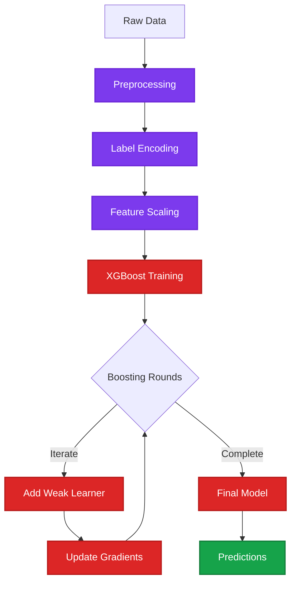

# XGBoost Customer Segmentation

An advanced gradient boosting implementation using XGBoost for customer segmentation with Streamlit interface. XGBoost provides state-of-the-art performance through optimized distributed gradient boosting.

## 📊 Algorithm Overview

**XGBoost (Extreme Gradient Boosting)** is an optimized distributed gradient boosting library designed for efficiency, flexibility, and portability. It implements machine learning algorithms under the Gradient Boosting framework.

### Key Characteristics:
- **Regularization**: Built-in L1 and L2 regularization to prevent overfitting
- **Parallel Processing**: Utilizes multiple CPU cores
- **Tree Pruning**: Uses max_depth and prunes trees backward
- **Built-in Cross-Validation**: Native CV support
- **Missing Value Handling**: Automatically learns best direction for missing values
- **High Performance**: Optimized for speed and model accuracy

## ✨ Features

- **Interactive Streamlit Dashboard**: User-friendly web interface
- **Advanced Boosting**: State-of-the-art gradient boosting algorithm
- **Real-time Classification**: Instant customer segment predictions
- **Feature Importance**: Understand which features drive predictions
- **Model Persistence**: Trained models saved for reuse
- **Comprehensive Evaluation**: Multiple performance metrics

## 🛠️ Technologies

- **Python 3.8+**
- **Streamlit** - Web application framework
- **XGBoost** - Extreme gradient boosting library
- **scikit-learn** - Preprocessing and metrics
- **pandas** - Data manipulation
- **numpy** - Numerical computing
- **pickle** - Model serialization

## 📦 Dataset

**Customer Segmentation Dataset**

Features include:
- **Demographic**: Gender, Age, Marital Status, Education
- **Professional**: Profession, Work Experience
- **Behavioral**: Spending Score, Family Size
- **Target**: Customer Segmentation Class

**Data Files:**
- `data/Train.csv` - Training data
- `data/Test.csv` - Test data

## 🚀 Installation

```bash
# Navigate to project directory
cd Supervised_Learning/Classification/XgBoost

# Install dependencies
pip install -r requirements.txt
```

## 💻 Usage

```bash
# Run the Streamlit app
streamlit run Home.py
```

Access at `http://localhost:8501`

## 📁 Project Structure

```
XgBoost/
├── Home.py                 # Streamlit interface
├── utils.py                # XGBoost model implementation
├── data/
│   ├── Train.csv          # Training dataset
│   └── Test.csv           # Testing dataset
├── models/                 # Runtime generated
│   ├── xgboost_model.pkl  # Trained XGBoost model
│   ├── label_encoder.pkl  # Encoders
│   └── scaler.pkl         # Scaler
└── requirements.txt
```

## 📈 Model Performance

XGBoost typically achieves superior performance due to:
- Regularized learning objective
- Gradient-based optimization
- Ensemble of weak learners
- Feature importance ranking

## 🎯 Use Cases

- **Customer Segmentation**: High-accuracy customer grouping
- **Churn Prediction**: Identify at-risk customers
- **Credit Scoring**: Financial risk assessment
- **Recommendation Systems**: Personalized suggestions
- **Anomaly Detection**: Identify unusual patterns

## ⚙️ Hyperparameters

Key XGBoost parameters:
- `n_estimators`: Number of boosting rounds
- `max_depth`: Maximum tree depth
- `learning_rate`: Step size shrinkage
- `subsample`: Fraction of samples per tree
- `colsample_bytree`: Fraction of features per tree

## 🔍 Model Workflow



## 📚 References

- [XGBoost Documentation](https://xgboost.readthedocs.io/)
- [XGBoost: A Scalable Tree Boosting System](https://arxiv.org/abs/1603.02754)

---

**Developed by MEB**
