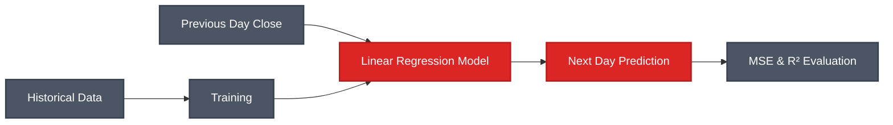

# Simple Linear Regression - Stock Price Prediction

A Streamlit application that predicts next-day NVIDIA stock closing prices using Simple Linear Regression based on historical price movements.

## 📊 Algorithm Overview

**Simple Linear Regression** models the relationship between two variables by fitting a linear equation to observed data. It predicts a dependent variable (Y) based on an independent variable (X) using the formula: Y = β₀ + β₁X.

### Key Characteristics:
- **Linear Relationship**: Models straight-line relationships
- **Single Predictor**: One independent variable
- **Least Squares**: Minimizes sum of squared residuals
- **Interpretable**: Clear coefficient interpretation
- **Fast**: Quick training and prediction
- **Foundation**: Basis for more complex models

## ✨ Features

- Interactive Streamlit dashboard
- Real-time stock price prediction
- Historical price visualization
- Model performance metrics (MSE, R²)
- Customizable prediction inputs
- Visual trend analysis with line charts
- Toggle between real and predicted values

## 🛠️ Technologies

- Python 3.8+
- Streamlit - Web framework
- scikit-learn - LinearRegression
- pandas - Data manipulation
- numpy - Numerical computing
- yfinance (likely) - Stock data fetching

## 📦 Dataset

**NVIDIA Stock Historical Data**

- Time series of closing prices
- Previous day closing price as predictor
- Next day closing price as target variable

## 🚀 Installation

```bash
cd Supervised_Learning/Regression/simple-linear-regression
pip install -r requirements.txt
```

## 💻 Usage

```bash
streamlit run main.py
```

### Features in the App:
1. **Input Closing Value**: Enter current day's closing price
2. **View Prediction**: See estimated next-day closing price
3. **Historical Analysis**: Visualize up to 250 days of history
4. **Toggle Views**: Show real prices, predictions, or both
5. **Color Coding**: Green for increases, red for decreases

## 📁 Project Structure

```
simple-linear-regression/
├── main.py          # Streamlit application
├── utils.py         # Model training and prediction logic
├── data/            # Historical stock data (generated)
├── models/          # Saved regression model
└── requirements.txt
```

## 📈 Model Performance

Evaluated using:
- **MSE (Mean Squared Error)**: Average squared prediction error
- **R² Score**: Proportion of variance explained
- **Visual Analysis**: Real vs. predicted price comparison

## 🎯 Use Cases

- Stock price forecasting
- Trend analysis
- Trading strategy development
- Time series prediction
- Financial modeling

## 🔍 Model Workflow



## 📝 Formula

```
Next_Day_Close = β₀ + β₁ × Current_Day_Close
```

Where:
- β₀ = Intercept
- β₁ = Slope (coefficient)

---

**Developed by MEB**
