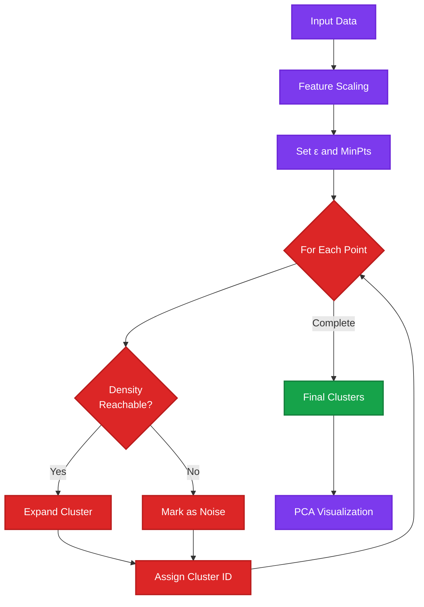

# DBSCAN Clustering

DBSCAN (Density-Based Spatial Clustering of Applications with Noise) implementation with Streamlit. A powerful density-based clustering algorithm that can find arbitrarily shaped clusters and identify outliers.

## 📊 Algorithm Overview

**DBSCAN** is a density-based clustering algorithm that groups together points that are closely packed, marking points in low-density regions as outliers. Unlike K-Means, it doesn't require specifying the number of clusters beforehand.

### Key Characteristics:
- **Density-Based**: Finds clusters of arbitrary shape
- **Automatic K**: Discovers number of clusters automatically
- **Noise Detection**: Identifies outliers as noise points
- **No Assumptions**: Doesn't assume spherical clusters
- **Robust**: Handles varying cluster densities reasonably well
- **Parameter-Driven**: Performance depends on ε (epsilon) and min_samples

## ✨ Features

- Interactive Streamlit interface
- Automatic cluster discovery
- Outlier detection and identification
- Arbitrary cluster shapes
- CSV file upload support
- Silhouette score evaluation (in pages)
- Visual cluster representation
- No need to specify K beforehand

## 🛠️ Technologies

- Python 3.8+
- Streamlit
- scikit-learn - DBSCAN
- pandas, numpy
- matplotlib, seaborn

## 📦 Datasets

**Included Datasets:**
- `data/BankChurners.csv`
- `data/CC GENERAL.csv`

## 🚀 Installation

```bash
cd Unsupervising_Learning/Clustering/DBSCAN
pip install -r requirements.txt
```

## 💻 Usage

```bash
streamlit run Home.py
```

### Features:
- Upload custom CSV data
- Automatic cluster detection
- Outlier identification
- Silhouette score analysis

## 📁 Project Structure

```
DBSCAN/
├── Home.py          # Main Streamlit app
├── utils.py         # Preprocessing utilities
├── data/
│   ├── BankChurners.csv
│   └── CC GENERAL.csv
├── pages/
│   └── Silhouette_score.py  # Cluster quality analysis
└── requirements.txt
```

## 📈 Model Workflow



## 🎯 Use Cases

- Geospatial data clustering
- Anomaly detection
- Customer behavior analysis with outliers
- Image segmentation
- Finding dense regions in data
- Noise filtering

## ⚙️ Hyperparameters

- **ε (epsilon)**: Maximum distance between two points to be neighbors
- **min_samples (MinPts)**: Minimum points required to form dense region
- **metric**: Distance metric (Euclidean, Manhattan, etc.)

## 📊 Cluster Types

- **Core Points**: Points with ≥ min_samples within ε
- **Border Points**: Within ε of core point but < min_samples neighbors
- **Noise Points**: Neither core nor border (outliers)

## 🔍 Advantages Over K-Means

| Feature | DBSCAN | K-Means |
|---------|--------|---------|
| Cluster Shape | Arbitrary | Spherical |
| Number of Clusters | Automatic | Must specify |
| Outlier Detection | Yes | No |
| Cluster Density | Variable | Uniform |

---

**Developed by MEB**
