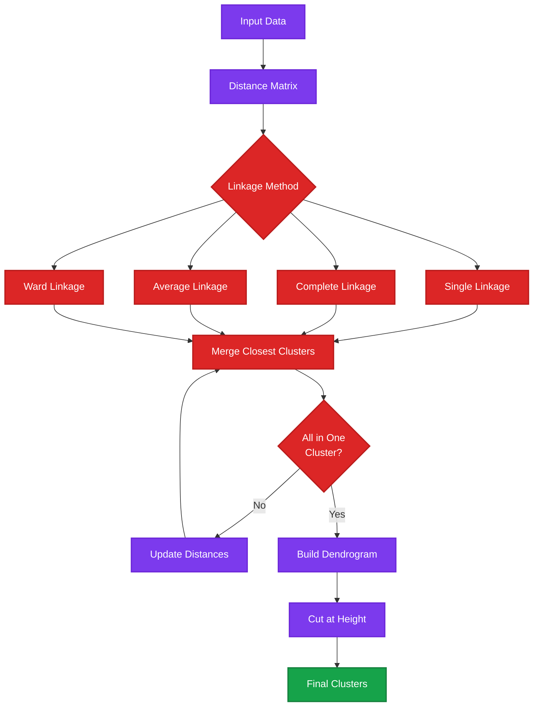

# Hierarchical Clustering

Hierarchical Clustering implementation with Streamlit. A tree-based clustering approach that builds a hierarchy of clusters through agglomerative or divisive methods.

## 📊 Algorithm Overview

**Hierarchical Clustering** creates a tree of clusters (dendrogram) by either merging clusters bottom-up (agglomerative) or splitting them top-down (divisive). It doesn't require specifying the number of clusters initially.

### Key Characteristics:
- **Hierarch ical Structure**: Creates tree-like cluster relationships
- **Dendrogram Visualization**: Shows cluster merging process
- **Flexible K**: Cut dendrogram at any height for desired K
- **Agglomerative**: Bottom-up approach (most common)
- **Multiple Linkages**: Different cluster distance metrics
- **Deterministic**: Same results each run

## ✨ Features

- Interactive Streamlit interface
- Dendrogram visualization
- Multiple linkage methods (single, complete, average, ward)
- CSV file upload
- Customizable cluster cutting
- Elbow method for optimal cluster selection (in pages)
- Distance matrix computation

## 🛠️ Technologies

- Python 3.8+
- Streamlit
- scikit-learn - AgglomerativeClustering
- scipy - Dendrogram, linkage
- pandas, numpy
- matplotlib, seaborn

## 📦 Datasets

**Included Datasets:**
- `data/BankChurners.csv`
- `data/CC GENERAL.csv`

## 🚀 Installation

```bash
cd Unsupervising_Learning/Clustering/Hierarchical_Clustering
pip install -r requirements.txt
```

## 💻 Usage

```bash
streamlit run Home.py
```

### Features:
- Upload CSV data
- View dendrogram
- Select cutting height
- Visualize resulting clusters
- Elbow method analysis

## 📁 Project Structure

```
Hierarchical_Clustering/
├── Home.py          # Main Streamlit application
├── utils.py         # Preprocessing utilities
├── data/
│   ├── BankChurners.csv
│   └── CC GENERAL.csv
├── pages/
│   └── Elbow_method.py  # Optimal cluster selection
└── requirements.txt
```

## 📈 Model Workflow



## 🎯 Use Cases

- Gene expression analysis
- Document clustering
- Social network analysis
- Image segmentation
- Taxonomy creation
- Market segmentation

## ⚙️ Linkage Methods

- **Single**: Minimum distance between clusters
- **Complete**: Maximum distance between clusters
- **Average**: Average distance between all pairs
- **Ward**: Minimizes within-cluster variance (most common)

## 📊 Evaluation

- **Dendrogram**: Visual tree structure
- **Elbow Method**: Optimal cluster count
- **Cophenetic Correlation**: Dendrogram quality
- **Silhouette Score**: Cluster separation

## 🔍 Advantages

- **Visual**: Dendrogram shows cluster relationships
- **Flexible**: Choose K after seeing structure
- **Deterministic**: Reproducible results
- **Hierarchical Insights**: Understand cluster relationships

## 🔄 Hierarchical vs K-Means

| Feature | Hierarchical | K-Means |
|---------|--------------|---------|
| K Selection | After clustering | Before clustering |
| Visualization | Dendrogram | Scatter plot |
| Scalability | O(n²) - slower | O(n) - faster |
| Deterministic | Yes | No (random init) |
| Hierarchy | Yes | No |

---

**Developed by MEB**
