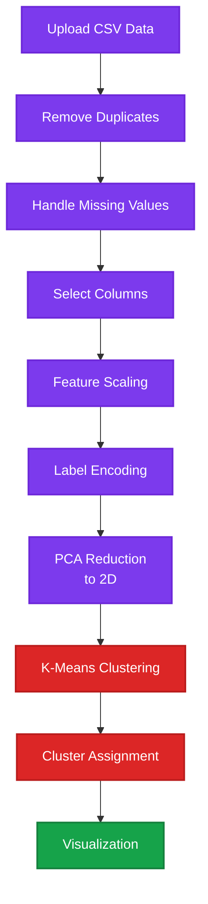

# K-Means Clustering

K-Means clustering implementation with interactive Streamlit interface for unsupervised learning and data segmentation. A popular centroid-based clustering algorithm.

## 📊 Algorithm Overview

**K-Means** is an unsupervised learning algorithm that partitions data into K distinct clusters based on feature similarity. It iteratively assigns points to the nearest centroid and updates centroids until convergence.

### Key Characteristics:
- **Unsupervised**: No labels required
- **Centroid-Based**: Clusters defined by center points
- **Iterative**: Alternates between assignment and update steps
- **Scalable**: Efficient for large datasets
- **Simple**: Easy to understand and implement
- **K Selection**: Requires choosing number of clusters

## ✨ Features

- Interactive Streamlit web interface
- Upload custom CSV datasets
- Dynamic column selection
- Configurable number of clusters (1-20)
- PCA dimensionality reduction for visualization
- Automated data preprocessing:
  - Duplicate removal
  - Missing value handling
  - Label encoding
  - Feature scaling
- Visual cluster representation with scatter plots
- Progress tracking

## 🛠️ Technologies

- Python 3.8+
- Streamlit - Interactive web interface
- scikit-learn - KMeans, PCA, preprocessing
- pandas - Data manipulation
- numpy - Numerical computing
- matplotlib - Plotting
- seaborn - Enhanced visualizations

## 📦 Datasets

**Included Datasets:**
- `data/BankChurners.csv` - Bank customer data
- `data/CC GENERAL.csv` - Credit card customer data

**Custom Datasets:**
- Upload any CSV file via web interface

## 🚀 Installation

```bash
cd Unsupervising_Learning/Clustering/K-means
pip install -r requirements.txt
```

## 💻 Usage

```bash
streamlit run Home.py
```

### Steps in the App:
1. Upload CSV file or use provided datasets
2. View data preview
3. Select main clustering column
4. Choose processing columns
5. Set number of clusters (K)
6. Click "Model oluştur" (Create Model)
7. View clustered results with PCA visualization

## 📁 Project Structure

```
K-means/
├── Home.py          # Main Streamlit application
├── utils.py         # Preprocessing utilities (scale, encode)
├── data/
│   ├── BankChurners.csv
│   └── CC GENERAL.csv
├── pages/
│   └── k-means_status.py  # Additional analysis page
└── requirements.txt
```

## 📈 Model Workflow



## 🎯 Use Cases

- Customer segmentation
- Market basket analysis
- Document clustering
- Image compression
- Anomaly detection
- Geographic data analysis

## ⚙️ Hyperparameters

- `n_clusters (K)`: Number of clusters (1-20)
- `n_components` (PCA): Reduced to 2 for visualization
- `max_iter`: Maximum iterations (default sklearn settings)

## 📊 Cluster Evaluation

- **Visual Inspection**: PCA scatter plot with cluster colors
- **Elbow Method**: Available in `pages/k-means_status.py`
- **Silhouette Score**: Cluster quality metric

## 🔍 Algorithm Steps

1. **Initialize**: Randomly select K centroids
2. **Assignment**: Assign each point to nearest centroid
3. **Update**: Recalculate centroids as cluster means
4. **Repeat**: Iterate until convergence
5. **Visualize**: Project to 2D using PCA

---

**Developed by MEB**
